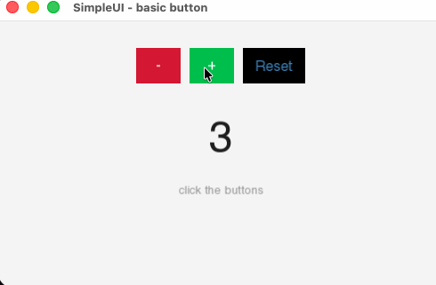

# SimpleUI



> Three buttons, a live counter, ~15 lines of logic. Full source in [`examples/basic_button/main.cpp`](examples/basic_button/main.cpp).

```cpp
Button btnPlus ("+",     {0.f, 0.f}, {50.f, 40.f});
Button btnMinus("-",     {0.f, 0.f}, {50.f, 40.f});
Button btnReset("Reset", {0.f, 0.f}, {70.f, 40.f});

btnPlus .style(Presets::Success());
btnMinus.style(Presets::Danger());
btnReset.style(Presets::Ghost());

int counter = 0;
btnPlus .onClick([&counter] { counter++; });
btnMinus.onClick([&counter] { counter--; });
btnReset.onClick([&counter] { counter = 0; });
```

A lightweight, header-only UI widget library for **SFML 3.0**, written in C++17.

Built to make adding interactive UI elements to SFML applications quick and painless — no heavy frameworks, no dependencies beyond SFML itself.

## Features

- **Header-only** — just drop the `include/` folder into your project
- **Button widget** with hover/press animations and smooth color transitions
- **Chainable API** — configure widgets fluently in a single expression
- **Event system** — simple signal/callback pattern (`Event<Args...>`)
- **Style presets** — `Primary`, `Danger`, `Success`, `Ghost` out of the box
- **Global Theme** — configure fonts, colors and sizes once, applied everywhere

## Requirements

- C++17 or later
- [SFML 3.0](https://www.sfml-dev.org/)
- CMake 3.16+ *(if using the provided CMakeLists)*

## Installation

SimpleUI is header-only. Copy the `include/SimpleUI` directory into your project and add it to your include path.

**With CMake (FetchContent):**
```cmake
include(FetchContent)
FetchContent_Declare(
    SimpleUI
    GIT_REPOSITORY https://github.com/Hebortinko/SimpleUI.git
    GIT_TAG        v0.1.0
)
FetchContent_MakeAvailable(SimpleUI)

target_link_libraries(your_target PRIVATE SimpleUI)
```

**Manual:**
```cmake
target_include_directories(your_target PRIVATE path/to/SimpleUI/include)
```

## Quick Start

```cpp
#include <SimpleUI/Widgets/Button.h>
#include <SimpleUI/Style/Presets.h>
#include <SFML/Graphics.hpp>

int main()
{
    sf::RenderWindow window(sf::VideoMode({800, 600}), "SimpleUI Demo");
    sf::Font font("assets/font.ttf");

    // Set the global font once
    Theme::get().font = &font;

    Button btn("Click me", {100.f, 100.f}, {120.f, 40.f});
    btn.style(Presets::Primary())
       .onClick([] { /* handle click */ });

    while (window.isOpen())
    {
        while (auto event = window.pollEvent())
        {
            if (event->is<sf::Event::Closed>()) window.close();
            btn.handleEvent(*event);
        }

        float dt = /* your delta time */;
        btn.update(dt);

        window.clear(sf::Color::White);
        btn.draw(window);
        window.display();
    }
}
```

## Style Presets

| Preset | Description |
|--------|-------------|
| `Presets::Primary()` | Blue — default action |
| `Presets::Success()` | Green — confirm / add |
| `Presets::Danger()` | Red — destructive action |
| `Presets::Ghost()` | Transparent with blue text |

Custom style:
```cpp
btn.style({
    .bgColor   = sf::Color(80, 40, 120),
    .bgHover   = sf::Color(110, 60, 160),
    .bgPressed = sf::Color(60, 20, 100),
    .textColor = sf::Color::White
});
```

## Widget API

All widgets inherit from `Widget` and share these methods:

```cpp
widget.setPosition({x, y});
widget.setSize({w, h});
widget.setVisible(bool);
widget.setEnabled(bool);
```

`Button` additionally supports a chainable API:

```cpp
Button btn("Label", pos, size);
btn.text("New label")
   .fontSize(18)
   .disabled(false)
   .style(Presets::Danger())
   .onClick([]  { /* click  */ })
   .onHover([]  { /* hover  */ })
   .onPress([]  { /* press  */ });
```

## Roadmap

- [x] `Button`
- [ ] `Label`
- [ ] `Checkbox`
- [ ] `Slider`
- [ ] `InputField`
- [ ] `Panel` (container)
- [ ] Layout system
- [ ] More built-in themes

## License

MIT — see [LICENSE](LICENSE) for details.